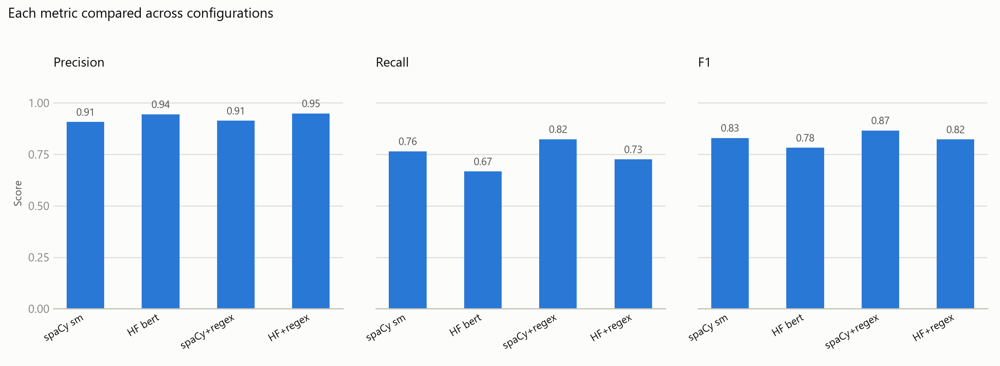
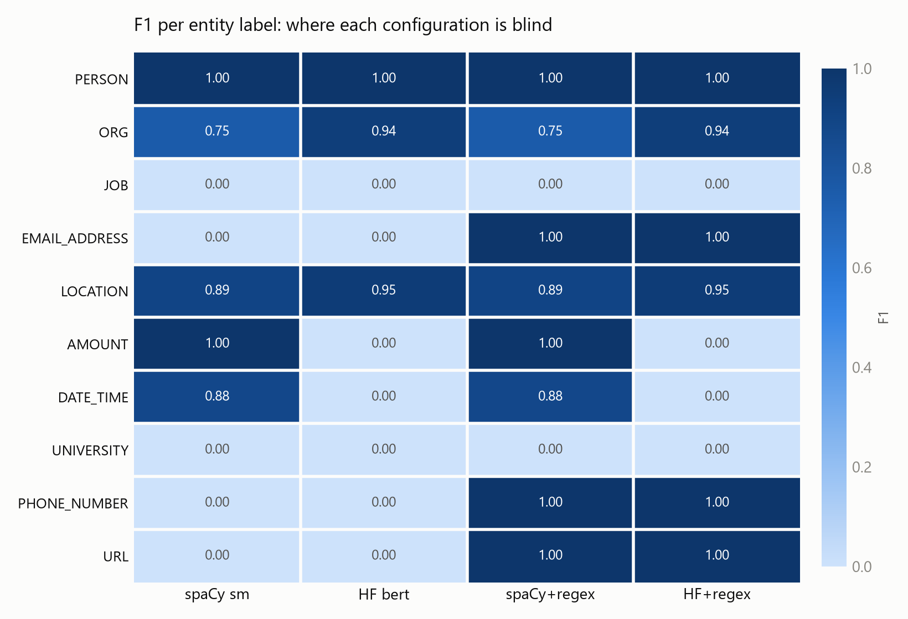

# Benchmark report

Regenerate with `uv run python src/make_report.py`. Evaluated on a labelled dataset
of 10 texts against the 12 target entity labels.

## Configurations compared

| Configuration | Detectors (priority order) |
|---|---|
| spaCy sm | en_core_web_sm |
| HF bert | dslim/bert-base-NER |
| spaCy+regex | regex rules + en_core_web_sm |
| HF+regex | regex rules + dslim/bert-base-NER |

Each detector exposes the same interface (`load()` and `detect(model, text)`), so a
configuration is just a list of detectors in priority order. Where two detectors
claim overlapping text, the earlier one wins, then the longer span.

## Overall results

Highest F1: **spaCy+regex**. Recall matters most here, because a missed identifier is a
leak, while a false positive only over-redacts.

Read down a single panel to compare one attribute across configurations: precision
stays flat while recall moves, which is where the differences actually live.

## Per-label coverage

The blank column blocks are the story: each configuration is blind to a different
set of labels.

## What the results show

- **The two models have complementary blind spots.** The transformer is stronger on
  the entity types both cover, reading context better. The spaCy pipeline covers
  date and money entities that the CoNLL-trained transformer has no labels for at
  all, so it wins overall despite being the smaller model.
- **The best model depends on label coverage, not just architecture.** A more modern
  architecture does not help for entity types absent from its training scheme.
- **Rules and models solve disjoint problems.** The regex layer scores highly on
  exactly the fixed-shape types (email, phone, URL) that both models score zero on,
  while the models handle open-class entities (people, organisations, locations)
  that no regular expression can express. Adding rules to either model raises recall
  with no loss of precision.
- **Hybrid wins.** The strongest configuration combines a model with the rule layer.

## How the scoring works

The anonymized RESULT is compared against the EXPECTED answer by aligning the two
token sequences (Python's `difflib`). Per label:

- **TP**: an expected `<LABEL>` the configuration also produced.
- **FP**: a `<LABEL>` produced where none was expected (over-anonymizing).
- **FN**: an expected `<LABEL>` that was missed (a leak).

From those, precision = TP/(TP+FP), recall = TP/(TP+FN), and F1 is their harmonic
mean. The micro-average pools every label's counts into one total.

Counts are aggregated over every occurrence of a label across all texts, not per
text, which is why a per-label score is usually a fraction: a label occurring eight
times with six caught and two missed scores 0.75, not 0 or 1. A label scores exactly
1.00 only when every occurrence was caught with no false positives, which is easiest
for labels that occur once or twice.

"Exact rows" counts texts where the whole anonymized output matched the expected
string character for character, which is a deliberately strict measure.

## Limitations

- The evaluation set is small, so per-label figures move a lot per entity; treat the
  numbers as indicative rather than precise.
- JOB and UNIVERSITY are not produced by any configuration. No standard NER scheme
  has those classes and they have no fixed shape for a rule to match, so they need a
  gazetteer, hand-written patterns, or a zero-shot model.
- Some expected labels are debatable (for example a telephone area code labelled as
  a location), so strict matching penalises otherwise reasonable output.
- The overlap-resolution rule never actually fires on this dataset: no spans were
  dropped for overlapping. It is defensive design for messier input and additional
  detectors, not a fix for an observed failure.

## Exact numbers

Every value plotted above, per configuration.

### spaCy sm

| Label | TP | FP | FN | Precision | Recall | F1 |
|---|---|---|---|---|---|---|
| PERSON | 7 | 0 | 0 | 1.00 | 1.00 | 1.00 |
| ORG | 6 | 2 | 2 | 0.75 | 0.75 | 0.75 |
| JOB | 0 | 0 | 2 | 0.00 | 0.00 | 0.00 |
| EMAIL_ADDRESS | 0 | 0 | 1 | 0.00 | 0.00 | 0.00 |
| LOCATION | 17 | 1 | 3 | 0.94 | 0.85 | 0.89 |
| AMOUNT | 2 | 0 | 0 | 1.00 | 1.00 | 1.00 |
| DATE_TIME | 7 | 1 | 1 | 0.88 | 0.88 | 0.88 |
| UNIVERSITY | 0 | 0 | 1 | 0.00 | 0.00 | 0.00 |
| PHONE_NUMBER | 0 | 0 | 1 | 0.00 | 0.00 | 0.00 |
| URL | 0 | 0 | 1 | 0.00 | 0.00 | 0.00 |
| **micro-average** | 39 | 4 | 12 | 0.91 | 0.76 | 0.83 |

### HF bert

| Label | TP | FP | FN | Precision | Recall | F1 |
|---|---|---|---|---|---|---|
| PERSON | 7 | 0 | 0 | 1.00 | 1.00 | 1.00 |
| ORG | 8 | 1 | 0 | 0.89 | 1.00 | 0.94 |
| JOB | 0 | 0 | 2 | 0.00 | 0.00 | 0.00 |
| EMAIL_ADDRESS | 0 | 0 | 1 | 0.00 | 0.00 | 0.00 |
| LOCATION | 19 | 1 | 1 | 0.95 | 0.95 | 0.95 |
| AMOUNT | 0 | 0 | 2 | 0.00 | 0.00 | 0.00 |
| DATE_TIME | 0 | 0 | 8 | 0.00 | 0.00 | 0.00 |
| UNIVERSITY | 0 | 0 | 1 | 0.00 | 0.00 | 0.00 |
| PHONE_NUMBER | 0 | 0 | 1 | 0.00 | 0.00 | 0.00 |
| URL | 0 | 0 | 1 | 0.00 | 0.00 | 0.00 |
| **micro-average** | 34 | 2 | 17 | 0.94 | 0.67 | 0.78 |

### spaCy+regex

| Label | TP | FP | FN | Precision | Recall | F1 |
|---|---|---|---|---|---|---|
| PERSON | 7 | 0 | 0 | 1.00 | 1.00 | 1.00 |
| ORG | 6 | 2 | 2 | 0.75 | 0.75 | 0.75 |
| JOB | 0 | 0 | 2 | 0.00 | 0.00 | 0.00 |
| EMAIL_ADDRESS | 1 | 0 | 0 | 1.00 | 1.00 | 1.00 |
| LOCATION | 17 | 1 | 3 | 0.94 | 0.85 | 0.89 |
| AMOUNT | 2 | 0 | 0 | 1.00 | 1.00 | 1.00 |
| DATE_TIME | 7 | 1 | 1 | 0.88 | 0.88 | 0.88 |
| UNIVERSITY | 0 | 0 | 1 | 0.00 | 0.00 | 0.00 |
| PHONE_NUMBER | 1 | 0 | 0 | 1.00 | 1.00 | 1.00 |
| URL | 1 | 0 | 0 | 1.00 | 1.00 | 1.00 |
| **micro-average** | 42 | 4 | 9 | 0.91 | 0.82 | 0.87 |

### HF+regex

| Label | TP | FP | FN | Precision | Recall | F1 |
|---|---|---|---|---|---|---|
| PERSON | 7 | 0 | 0 | 1.00 | 1.00 | 1.00 |
| ORG | 8 | 1 | 0 | 0.89 | 1.00 | 0.94 |
| JOB | 0 | 0 | 2 | 0.00 | 0.00 | 0.00 |
| EMAIL_ADDRESS | 1 | 0 | 0 | 1.00 | 1.00 | 1.00 |
| LOCATION | 19 | 1 | 1 | 0.95 | 0.95 | 0.95 |
| AMOUNT | 0 | 0 | 2 | 0.00 | 0.00 | 0.00 |
| DATE_TIME | 0 | 0 | 8 | 0.00 | 0.00 | 0.00 |
| UNIVERSITY | 0 | 0 | 1 | 0.00 | 0.00 | 0.00 |
| PHONE_NUMBER | 1 | 0 | 0 | 1.00 | 1.00 | 1.00 |
| URL | 1 | 0 | 0 | 1.00 | 1.00 | 1.00 |
| **micro-average** | 37 | 2 | 14 | 0.95 | 0.73 | 0.82 |
