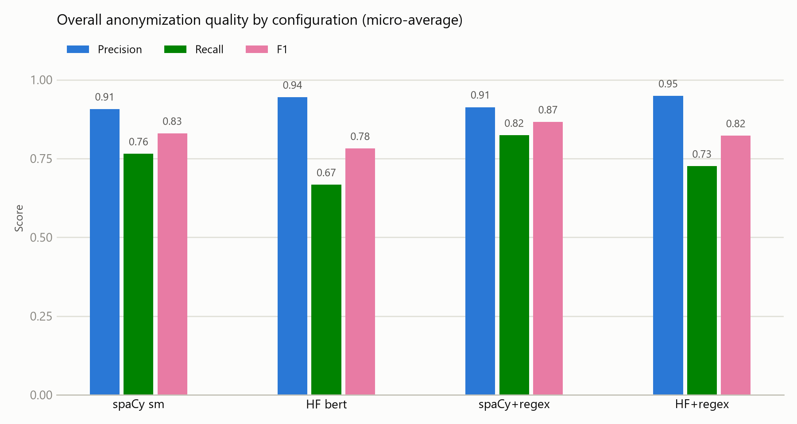
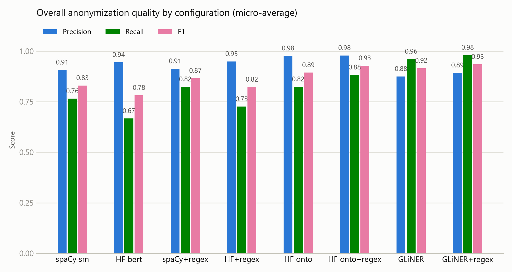
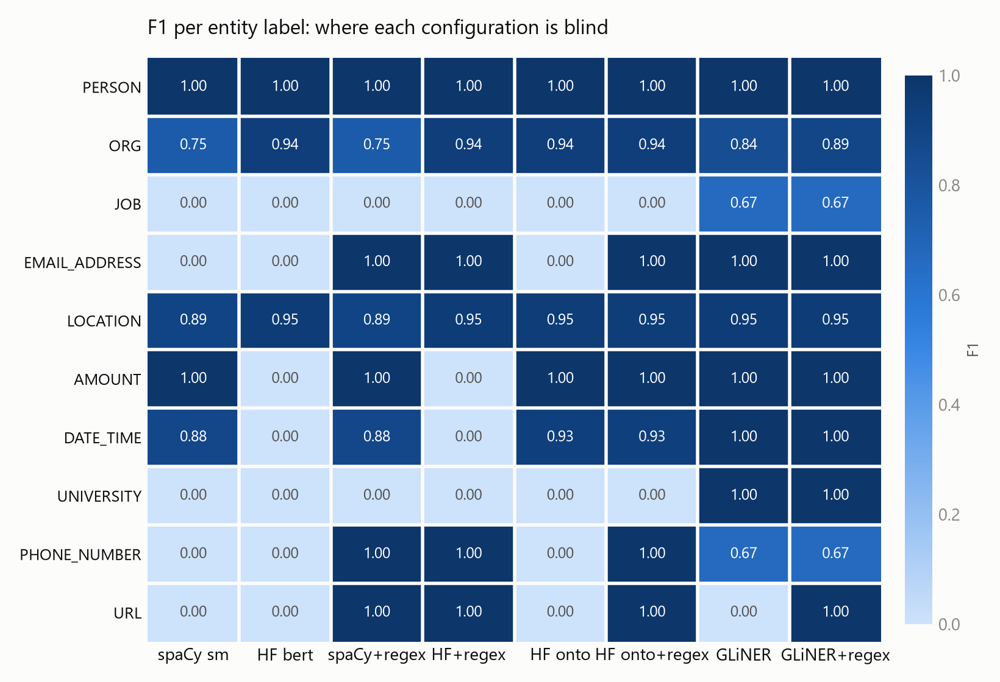

# Benchmark report

Regenerate with `uv run anonymizer-report`. Evaluated on a labelled dataset of
10 texts against the 12 target entity labels.

## The required comparison

Two pre-trained NER models measured against each other, and each one paired with the
rule layer. This is the result the exercise asked for; nothing below changes it.

| Configuration | Detectors (priority order) |
|---|---|
| spaCy sm | en_core_web_sm |
| HF bert | dslim/bert-base-NER |
| spaCy+regex | regex rules + en_core_web_sm |
| HF+regex | regex rules + dslim/bert-base-NER |

Each detector exposes the same interface (`load()` and `detect(model, text)`), so a
configuration is just a list of detectors in priority order. Where two detectors
claim overlapping text, the earlier one wins, then the longer span.

### Overall results

Highest F1: **spaCy+regex**. Recall matters most here, because a missed identifier is
a leak, while a false positive only over-redacts.

| Configuration | Precision | Recall | F1 | Exact rows |
|---|---|---|---|---|
| spaCy sm | 0.91 | 0.76 | 0.83 | 2/10 |
| HF bert | 0.94 | 0.67 | 0.78 | 1/10 |
| spaCy+regex | 0.91 | 0.82 | 0.87 | 3/10 |
| HF+regex | 0.95 | 0.73 | 0.82 | 1/10 |

### Per-label coverage

| Label (F1) | spaCy sm | HF bert | spaCy+regex | HF+regex |
|---|---|---|---|---|
| PERSON | 1.00 | 1.00 | 1.00 | 1.00 |
| ORG | 0.75 | 0.94 | 0.75 | 0.94 |
| JOB | 0.00 | 0.00 | 0.00 | 0.00 |
| EMAIL_ADDRESS | 0.00 | 0.00 | 1.00 | 1.00 |
| LOCATION | 0.89 | 0.95 | 0.89 | 0.95 |
| AMOUNT | 1.00 | 0.00 | 1.00 | 0.00 |
| DATE_TIME | 0.88 | 0.00 | 0.88 | 0.00 |
| UNIVERSITY | 0.00 | 0.00 | 0.00 | 0.00 |
| PHONE_NUMBER | 0.00 | 0.00 | 1.00 | 1.00 |
| URL | 0.00 | 0.00 | 1.00 | 1.00 |

### What the required comparison shows

- **The two models have complementary blind spots.** The transformer is stronger on
  the entity types both cover, reading context better. The spaCy pipeline covers date
  and money entities that the CoNLL-trained transformer has no labels for at all, so
  it wins overall despite being the smaller model.
- **Rules and models solve disjoint problems.** The regex layer scores highly on
  exactly the fixed-shape types (email, phone, URL) that both models score zero on,
  while the models handle open-class entities (people, organisations, locations) that
  no regular expression can express. Adding rules to either model raises recall with
  no loss of precision.
- **Hybrid wins.** The strongest configuration combines a model with the rule layer.

## Beyond the required comparison

The comparison above answers the question that was set. Three further configurations
were then measured to test two specific objections to it. They are reported
separately so they cannot be mistaken for the original result, and adding them did
not change any number above.

| Configuration | Detectors (priority order) |
|---|---|
| HF onto | djagatiya/ner-roberta-base-ontonotesv5-englishv4 |
| HF onto+regex | regex rules + djagatiya/ner-roberta-base-ontonotesv5-englishv4 |
| GLiNER | urchade/gliner_base |
| GLiNER+regex | regex rules + urchade/gliner_base |

### Objection 1: was the transformer beaten by its architecture, or by its labels?

The transformer in the required comparison is trained on CoNLL-2003, which defines
only four entity types, so it can never emit a date or an amount. That is a property
of the training scheme rather than of the architecture, and it alone could explain
why the smaller model won.

Running the same kind of transformer trained on **OntoNotes**, the scheme spaCy also
uses, settles it: on equal footing the transformer is the stronger model, beating
spaCy on organisations, locations and dates, at a markedly higher precision.

**The original conclusion therefore needs stating carefully.** The smaller model won
that comparison, but not because it was the better model. It won because the other
one was blind to a third of the labels being asked for.

### Objection 2: are JOB and UNIVERSITY actually unreachable?

Every configuration in the required comparison scores zero on both, because no
standard NER scheme contains those classes. A **zero-shot** model is given its label
names at inference time instead of being limited to what it was trained on, so it can
simply be asked for them.

That breaks the wall: both labels are detected for the first time. It also produces
the highest recall of any configuration measured, which matters here more than F1,
since a miss is a leak and a false positive only over-redacts.

### All configurations

| Configuration | Precision | Recall | F1 | Exact rows |
|---|---|---|---|---|
| spaCy sm | 0.91 | 0.76 | 0.83 | 2/10 |
| HF bert | 0.94 | 0.67 | 0.78 | 1/10 |
| spaCy+regex | 0.91 | 0.82 | 0.87 | 3/10 |
| HF+regex | 0.95 | 0.73 | 0.82 | 1/10 |
| HF onto | 0.98 | 0.82 | 0.89 | 0/10 |
| HF onto+regex | 0.98 | 0.88 | 0.93 | 0/10 |
| GLiNER | 0.88 | 0.96 | 0.92 | 2/10 |
| GLiNER+regex | 0.89 | 0.98 | 0.93 | 3/10 |

| Label (F1) | spaCy sm | HF bert | spaCy+regex | HF+regex | HF onto | HF onto+regex | GLiNER | GLiNER+regex |
|---|---|---|---|---|---|---|---|---|
| PERSON | 1.00 | 1.00 | 1.00 | 1.00 | 1.00 | 1.00 | 1.00 | 1.00 |
| ORG | 0.75 | 0.94 | 0.75 | 0.94 | 0.94 | 0.94 | 0.84 | 0.89 |
| JOB | 0.00 | 0.00 | 0.00 | 0.00 | 0.00 | 0.00 | 0.67 | 0.67 |
| EMAIL_ADDRESS | 0.00 | 0.00 | 1.00 | 1.00 | 0.00 | 1.00 | 1.00 | 1.00 |
| LOCATION | 0.89 | 0.95 | 0.89 | 0.95 | 0.95 | 0.95 | 0.95 | 0.95 |
| AMOUNT | 1.00 | 0.00 | 1.00 | 0.00 | 1.00 | 1.00 | 1.00 | 1.00 |
| DATE_TIME | 0.88 | 0.00 | 0.88 | 0.00 | 0.93 | 0.93 | 1.00 | 1.00 |
| UNIVERSITY | 0.00 | 0.00 | 0.00 | 0.00 | 0.00 | 0.00 | 1.00 | 1.00 |
| PHONE_NUMBER | 0.00 | 0.00 | 1.00 | 1.00 | 0.00 | 1.00 | 0.67 | 0.67 |
| URL | 0.00 | 0.00 | 1.00 | 1.00 | 0.00 | 1.00 | 0.00 | 1.00 |

- Highest F1: **GLiNER+regex** at 0.93.
- Highest recall: **GLiNER+regex** at 0.98, and recall is the
  metric this task should be judged on.
- Exact-row match falls for the OntoNotes configurations even though their F1 rises,
  because that model tends to include trailing punctuation inside an entity. Exact
  match is unforgiving of boundaries in a way that per-label scoring is not, which is
  a good illustration of why more than one measure is reported.

## How the scoring works

The anonymized RESULT is compared against the EXPECTED answer by aligning the two
token sequences (Python's `difflib`). Per label:

- **TP**: an expected `<LABEL>` the configuration also produced.
- **FP**: a `<LABEL>` produced where none was expected (over-anonymizing).
- **FN**: an expected `<LABEL>` that was missed (a leak).

From those, precision = TP/(TP+FP), recall = TP/(TP+FN), and F1 is their harmonic
mean. The micro-average pools every label's counts into one total.

Counts are aggregated over every occurrence of a label across all texts, not per
text, which is why a per-label score is usually a fraction: a label occurring eight
times with six caught and two missed scores 0.75, not 0 or 1. A label scores exactly
1.00 only when every occurrence was caught with no false positives, which is easiest
for labels that occur once or twice.

"Exact rows" counts texts where the whole anonymized output matched the expected
string character for character, which is a deliberately strict measure.

## Limitations

- The evaluation set is small, so per-label figures move a lot per entity; treat the
  numbers as indicative rather than precise.
- Some expected labels are debatable (for example a telephone area code labelled as
  a location), so strict matching penalises otherwise reasonable output.
- The overlap-resolution rule never actually fires on this dataset: no spans were
  dropped for overlapping. It is defensive design for messier input and additional
  detectors, not a fix for an observed failure.
- The zero-shot configuration is noisier than a fine-tuned one, since nothing was
  trained on these exact label names; predictions below a confidence threshold are
  discarded.

## Exact numbers

Every value plotted above, per configuration.

### spaCy sm

| Label | TP | FP | FN | Precision | Recall | F1 |
|---|---|---|---|---|---|---|
| PERSON | 7 | 0 | 0 | 1.00 | 1.00 | 1.00 |
| ORG | 6 | 2 | 2 | 0.75 | 0.75 | 0.75 |
| JOB | 0 | 0 | 2 | 0.00 | 0.00 | 0.00 |
| EMAIL_ADDRESS | 0 | 0 | 1 | 0.00 | 0.00 | 0.00 |
| LOCATION | 17 | 1 | 3 | 0.94 | 0.85 | 0.89 |
| AMOUNT | 2 | 0 | 0 | 1.00 | 1.00 | 1.00 |
| DATE_TIME | 7 | 1 | 1 | 0.88 | 0.88 | 0.88 |
| UNIVERSITY | 0 | 0 | 1 | 0.00 | 0.00 | 0.00 |
| PHONE_NUMBER | 0 | 0 | 1 | 0.00 | 0.00 | 0.00 |
| URL | 0 | 0 | 1 | 0.00 | 0.00 | 0.00 |
| **micro-average** | 39 | 4 | 12 | 0.91 | 0.76 | 0.83 |

### HF bert

| Label | TP | FP | FN | Precision | Recall | F1 |
|---|---|---|---|---|---|---|
| PERSON | 7 | 0 | 0 | 1.00 | 1.00 | 1.00 |
| ORG | 8 | 1 | 0 | 0.89 | 1.00 | 0.94 |
| JOB | 0 | 0 | 2 | 0.00 | 0.00 | 0.00 |
| EMAIL_ADDRESS | 0 | 0 | 1 | 0.00 | 0.00 | 0.00 |
| LOCATION | 19 | 1 | 1 | 0.95 | 0.95 | 0.95 |
| AMOUNT | 0 | 0 | 2 | 0.00 | 0.00 | 0.00 |
| DATE_TIME | 0 | 0 | 8 | 0.00 | 0.00 | 0.00 |
| UNIVERSITY | 0 | 0 | 1 | 0.00 | 0.00 | 0.00 |
| PHONE_NUMBER | 0 | 0 | 1 | 0.00 | 0.00 | 0.00 |
| URL | 0 | 0 | 1 | 0.00 | 0.00 | 0.00 |
| **micro-average** | 34 | 2 | 17 | 0.94 | 0.67 | 0.78 |

### spaCy+regex

| Label | TP | FP | FN | Precision | Recall | F1 |
|---|---|---|---|---|---|---|
| PERSON | 7 | 0 | 0 | 1.00 | 1.00 | 1.00 |
| ORG | 6 | 2 | 2 | 0.75 | 0.75 | 0.75 |
| JOB | 0 | 0 | 2 | 0.00 | 0.00 | 0.00 |
| EMAIL_ADDRESS | 1 | 0 | 0 | 1.00 | 1.00 | 1.00 |
| LOCATION | 17 | 1 | 3 | 0.94 | 0.85 | 0.89 |
| AMOUNT | 2 | 0 | 0 | 1.00 | 1.00 | 1.00 |
| DATE_TIME | 7 | 1 | 1 | 0.88 | 0.88 | 0.88 |
| UNIVERSITY | 0 | 0 | 1 | 0.00 | 0.00 | 0.00 |
| PHONE_NUMBER | 1 | 0 | 0 | 1.00 | 1.00 | 1.00 |
| URL | 1 | 0 | 0 | 1.00 | 1.00 | 1.00 |
| **micro-average** | 42 | 4 | 9 | 0.91 | 0.82 | 0.87 |

### HF+regex

| Label | TP | FP | FN | Precision | Recall | F1 |
|---|---|---|---|---|---|---|
| PERSON | 7 | 0 | 0 | 1.00 | 1.00 | 1.00 |
| ORG | 8 | 1 | 0 | 0.89 | 1.00 | 0.94 |
| JOB | 0 | 0 | 2 | 0.00 | 0.00 | 0.00 |
| EMAIL_ADDRESS | 1 | 0 | 0 | 1.00 | 1.00 | 1.00 |
| LOCATION | 19 | 1 | 1 | 0.95 | 0.95 | 0.95 |
| AMOUNT | 0 | 0 | 2 | 0.00 | 0.00 | 0.00 |
| DATE_TIME | 0 | 0 | 8 | 0.00 | 0.00 | 0.00 |
| UNIVERSITY | 0 | 0 | 1 | 0.00 | 0.00 | 0.00 |
| PHONE_NUMBER | 1 | 0 | 0 | 1.00 | 1.00 | 1.00 |
| URL | 1 | 0 | 0 | 1.00 | 1.00 | 1.00 |
| **micro-average** | 37 | 2 | 14 | 0.95 | 0.73 | 0.82 |

### HF onto

| Label | TP | FP | FN | Precision | Recall | F1 |
|---|---|---|---|---|---|---|
| PERSON | 7 | 0 | 0 | 1.00 | 1.00 | 1.00 |
| ORG | 8 | 1 | 0 | 0.89 | 1.00 | 0.94 |
| JOB | 0 | 0 | 2 | 0.00 | 0.00 | 0.00 |
| EMAIL_ADDRESS | 0 | 0 | 1 | 0.00 | 0.00 | 0.00 |
| LOCATION | 18 | 0 | 2 | 1.00 | 0.90 | 0.95 |
| AMOUNT | 2 | 0 | 0 | 1.00 | 1.00 | 1.00 |
| DATE_TIME | 7 | 0 | 1 | 1.00 | 0.88 | 0.93 |
| UNIVERSITY | 0 | 0 | 1 | 0.00 | 0.00 | 0.00 |
| PHONE_NUMBER | 0 | 0 | 1 | 0.00 | 0.00 | 0.00 |
| URL | 0 | 0 | 1 | 0.00 | 0.00 | 0.00 |
| **micro-average** | 42 | 1 | 9 | 0.98 | 0.82 | 0.89 |

### HF onto+regex

| Label | TP | FP | FN | Precision | Recall | F1 |
|---|---|---|---|---|---|---|
| PERSON | 7 | 0 | 0 | 1.00 | 1.00 | 1.00 |
| ORG | 8 | 1 | 0 | 0.89 | 1.00 | 0.94 |
| JOB | 0 | 0 | 2 | 0.00 | 0.00 | 0.00 |
| EMAIL_ADDRESS | 1 | 0 | 0 | 1.00 | 1.00 | 1.00 |
| LOCATION | 18 | 0 | 2 | 1.00 | 0.90 | 0.95 |
| AMOUNT | 2 | 0 | 0 | 1.00 | 1.00 | 1.00 |
| DATE_TIME | 7 | 0 | 1 | 1.00 | 0.88 | 0.93 |
| UNIVERSITY | 0 | 0 | 1 | 0.00 | 0.00 | 0.00 |
| PHONE_NUMBER | 1 | 0 | 0 | 1.00 | 1.00 | 1.00 |
| URL | 1 | 0 | 0 | 1.00 | 1.00 | 1.00 |
| **micro-average** | 45 | 1 | 6 | 0.98 | 0.88 | 0.93 |

### GLiNER

| Label | TP | FP | FN | Precision | Recall | F1 |
|---|---|---|---|---|---|---|
| PERSON | 7 | 0 | 0 | 1.00 | 1.00 | 1.00 |
| ORG | 8 | 3 | 0 | 0.73 | 1.00 | 0.84 |
| JOB | 2 | 2 | 0 | 0.50 | 1.00 | 0.67 |
| EMAIL_ADDRESS | 1 | 0 | 0 | 1.00 | 1.00 | 1.00 |
| LOCATION | 19 | 1 | 1 | 0.95 | 0.95 | 0.95 |
| AMOUNT | 2 | 0 | 0 | 1.00 | 1.00 | 1.00 |
| DATE_TIME | 8 | 0 | 0 | 1.00 | 1.00 | 1.00 |
| UNIVERSITY | 1 | 0 | 0 | 1.00 | 1.00 | 1.00 |
| PHONE_NUMBER | 1 | 1 | 0 | 0.50 | 1.00 | 0.67 |
| URL | 0 | 0 | 1 | 0.00 | 0.00 | 0.00 |
| **micro-average** | 49 | 7 | 2 | 0.88 | 0.96 | 0.92 |

### GLiNER+regex

| Label | TP | FP | FN | Precision | Recall | F1 |
|---|---|---|---|---|---|---|
| PERSON | 7 | 0 | 0 | 1.00 | 1.00 | 1.00 |
| ORG | 8 | 2 | 0 | 0.80 | 1.00 | 0.89 |
| JOB | 2 | 2 | 0 | 0.50 | 1.00 | 0.67 |
| EMAIL_ADDRESS | 1 | 0 | 0 | 1.00 | 1.00 | 1.00 |
| LOCATION | 19 | 1 | 1 | 0.95 | 0.95 | 0.95 |
| AMOUNT | 2 | 0 | 0 | 1.00 | 1.00 | 1.00 |
| DATE_TIME | 8 | 0 | 0 | 1.00 | 1.00 | 1.00 |
| UNIVERSITY | 1 | 0 | 0 | 1.00 | 1.00 | 1.00 |
| PHONE_NUMBER | 1 | 1 | 0 | 0.50 | 1.00 | 0.67 |
| URL | 1 | 0 | 0 | 1.00 | 1.00 | 1.00 |
| **micro-average** | 50 | 6 | 1 | 0.89 | 0.98 | 0.93 |
